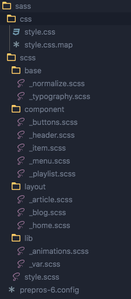

# Estructura 

Una estructura de archivos que puede llegar hacer muy util por su facil entendimiento 
y escalabilidad, es la siguiente

En este caso el orden de los imports en el 
archivo style.scss seria el siguiente

- lib
- base
- otros ....